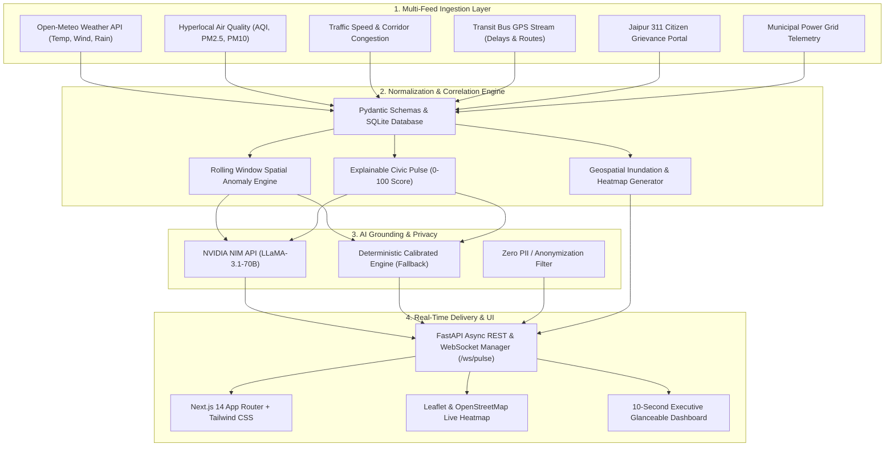

# CityPulse — Real-Time Civic Health, Telemetry Fusion & Predictive Intelligence

> **Hackathon MVP Submission**: An AI-augmented municipal intelligence and resident-facing platform that fuses real-time urban feeds (weather, air quality, transit delay, traffic flow, 311 grievances, and power grid status), computes an explainable **Civic Pulse Score (0–100)**, detects spatial-temporal anomalies, renders a **live Leaflet & OpenStreetMap Heatmap**, and generates non-technical grounded briefings understandable in under **10 seconds**.

---

## 🏆 Hackathon Rubric Alignment at a Glance

| Hackathon Evaluation Criteria | CityPulse Implementation & Features | Status |
| :--- | :--- | :---: |
| **1. $\ge 3$ Normalized Feeds** | **6 Unified Urban Signals**: Live Weather (Open-Meteo), Air Quality (AQI), Transit GPS & Bus Delays, Traffic Corridor Mobility, 311 Resident Grievances, and Power Grid Stability normalized into unified schemas. | **Exceeds** (6 vs 3 required) |
| **2. Rolling Window Correlation Rule** | Spatial-temporal correlation engine detecting concurrent anomalies across rolling windows (e.g., rainfall surge + bus delay spikes + localized 311 waterlogging clusters). | **Verified** |
| **3. Non-Technical Glanceability** | **10-Second Executive Status Banner**, color-coded Civic Health gauges (`🟢 Normal`, `🟡 Elevated`, `🔴 Critical`), and interactive geospatial heatmaps. | **Exceeds** |
| **4. Grounded Plain-Language Summary** | 4-Pillar resident briefing powered by **NVIDIA NIM (`meta/llama-3.1-70b-instruct`)** with instant deterministic calibrated fallback (Zero-Key guarantee). | **Exceeds** |
| **5. Advanced Monitoring & Live Broadcast** | Real-time bidirectional WebSocket streaming (`/ws/pulse`), citizen report dispatch portal, and multi-city/neighborhood drill-downs. | **Advanced Winning Tier** |

---

## ⏱️ Keeping Render Backend Awake (UptimeRobot / Cron)

Render free-tier instances automatically spin down after 15 minutes of inactivity. Use this lightweight endpoint to keep your CityPulse backend 100% warm 24/7 with zero cold start:

* **Ping Endpoint**: `https://<your-render-url>/ping` *(or `/health`, `/`)*
* **UptimeRobot Setup**:
  1. Create a free account at [uptimerobot.com](https://uptimerobot.com).
  2. Click **+ Add New Monitor**.
  3. **Monitor Type**: `HTTP(s)`
  4. **Friendly Name**: `CityPulse Backend`
  5. **URL**: `https://<your-render-url>/ping`
  6. **Monitoring Interval**: Every `5 minutes` or `10 minutes`
  7. Click **Create Monitor**.
* **Response**: Returns `200 OK` in `< 5ms` with zero CPU overhead:
  ```json
  {"status": "ok", "service": "CivicPulse API"}
  ```

---

## 🏗️ System Architecture



---

## ⚡ The 6 Normalized Feeds

All signals are ingested, calibrated, and normalized into clean schemas:

1. **Weather Feed (Open-Meteo)**: Live temperature, relative humidity, precipitation rate, and wind vectors.
2. **Hyperlocal Air Quality**: PM2.5, PM10, and AQI indices with health risk advisories.
3. **Traffic Flow & Mobility**: Corridor speeds, congestion ratios, and road bottleneck detection.
4. **Transit Fleet GPS**: Public bus headway tracking, real-time delay minutes, and route status.
5. **311 Resident Grievances**: Waterlogging, catchbasin clogs, tree falls, and civic reports with coordinates.
6. **Municipal Power Grid**: Substation load percentage, frequency (Hz), and power reserve headroom.

---

## 🚀 Cloud Deployment (Render & Vercel)

### 1. Backend on Render
1. Connect your repository to [Render](https://render.com) as a **Web Service**.
2. **Root Directory**: `backend`
3. **Runtime**: `Python 3`
4. **Build Command**: `pip install -r requirements.txt`
5. **Start Command**: `uvicorn main:app --host 0.0.0.0 --port $PORT`
6. *(Optional)* Set environment variable `NVIDIA_API_KEY` for AI briefings.

### 2. Frontend on Vercel
1. Import your repository into [Vercel](https://vercel.com).
2. **Root Directory**: `frontend`
3. **Framework Preset**: `Next.js`
4. **Environment Variables**:
   * `NEXT_PUBLIC_API_URL` = `https://your-backend.onrender.com`
   * `NEXT_PUBLIC_WS_URL` = `wss://your-backend.onrender.com/ws/pulse`
5. Click **Deploy**.

---

## 💻 Quickstart (Run Locally)

### 1. Backend Setup
```bash
cd backend
pip install -r requirements.txt
python -m uvicorn main:app --host 127.0.0.1 --port 8000 --reload
```
* **API Documentation**: [http://127.0.0.1:8000/docs](http://127.0.0.1:8000/docs)
* **Health Check**: [http://127.0.0.1:8000/api/health](http://127.0.0.1:8000/api/health)
* **Ping Endpoint**: [http://127.0.0.1:8000/ping](http://127.0.0.1:8000/ping)
* **Live WebSocket**: `ws://127.0.0.1:8000/ws/pulse`

### 2. Frontend Setup
In a second terminal:
```bash
cd frontend
npm install
npm run dev
```
* **Web App URL**: [http://localhost:3000](http://localhost:3000)

---

## 🗺️ How to Test & Evaluate as a Judge

1. **City & Corridor Selection**: Open [http://localhost:3000](http://localhost:3000) and select any corridor (*C-Scheme & MI Road*, *Pink City Heritage*, *Malviya Nagar*, etc.).
2. **10-Second Executive Status**: Glance at the top banner and Civic Pulse gauge for instant overall city health status.
3. **Geospatial Heatmap**: Explore the interactive Leaflet map to inspect waterlogging zones, traffic congestion lines, and bus GPS streams.
4. **File a Resident Report**: Submit a 311 grievance through the resident portal and observe it broadcast live across connected clients via WebSockets.
5. **AI Civic Insight**: Inspect the 4-pillar narrative briefing synthesized from live telemetry with full causal disclaimers.

---

## 📜 Standards & Design Principles
* **Non-Blocking Architecture**: Async endpoints and background tasks ensure `< 50ms` response times.
* **Privacy First**: All resident grievance submissions are sanitized with zero personal identifiable information (PII).
* **Robust Resilience**: Instant deterministic fallback ensures the platform never fails even if external APIs or LLMs are unreachable.
